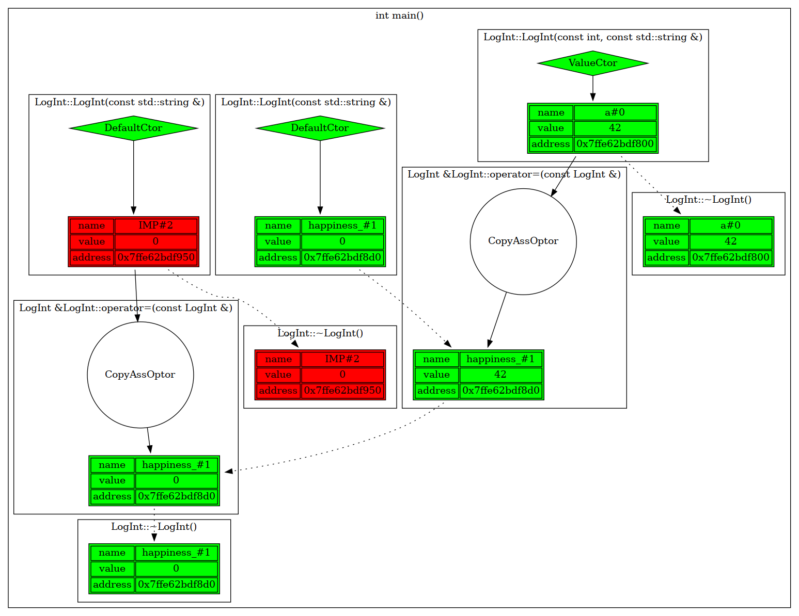
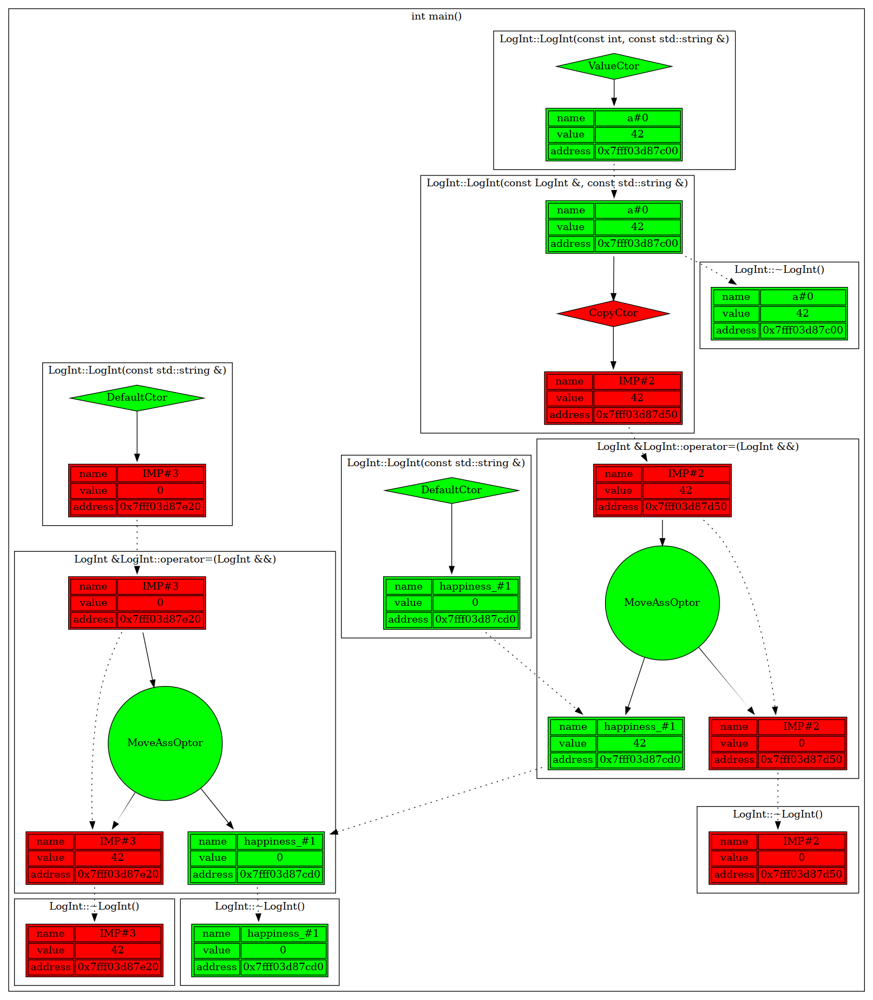
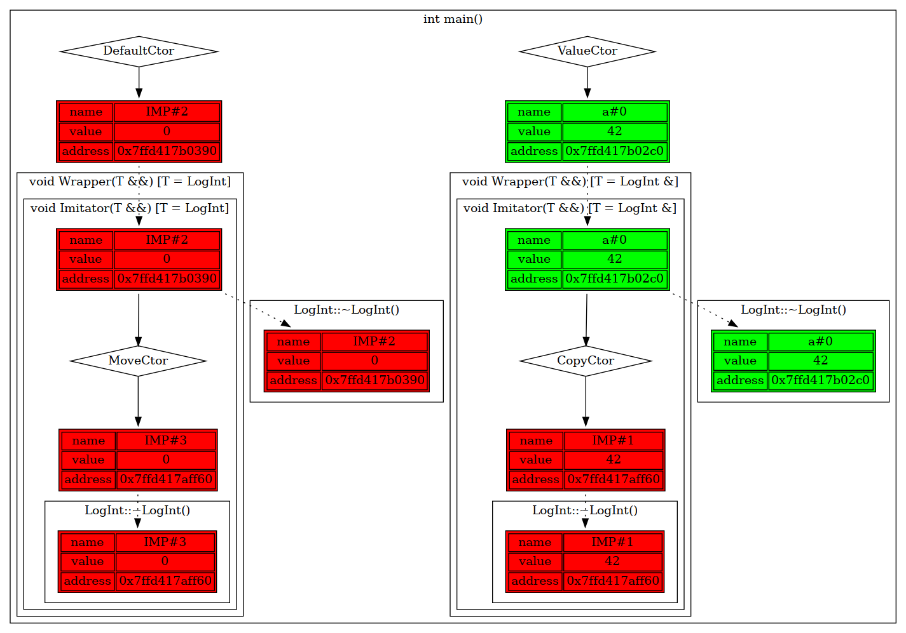

# std::move vs std::forward: differences and reasons for using both

## std::move
### Introduction
Let's write setter for some class.
```c++
 class Cat {
 public:
  void Meow() {
    // not implemented
    // depends on happiness
  }

  // calls when 'happiness' is lvalue
  void SetHappiness(const LogInt& happiness) {
    happiness_ = happiness; // copying assignment
  }

  // calls when 'happiness' is rvalue
  void SetHappiness(LogInt&& happiness) {
    happiness_ = happiness; // moving assignment
  }

 private:
  LOG_INT_DECL(happiness_);

};

int main() {
  LogIniter::GetInstance(LogType::GV);
  FUNC_LOG;

  LOG_INT_INIT_BY_VALUE(a, 42);

  Cat cat;
  cat.SetHappiness(a);
  cat.SetHappiness(LogInt());

  return 0;
}
```
`Cat::SetHappiness` is overloaded for two cases:
* `happiness` is `lvalue`. `Cat::SetHappiness(const LogInt&)` is called. Passed value **copied**.
* `happiness` is `rvalue`. `Cat::SetHappiness(LogInt&&)` is called. Passed value **moved**.

You can see results:
<pre>

</pre>

There's a way to avoid overloading. Let's forward `happiness` by value and move it to `Cat::happiness_`:
```c++
#include "log_initer.hpp"
#include "log_int.hpp"

class Cat {
 public:
  void Meow() {
    // not implemented
    // depends on happiness
  }

  // calls when 'happiness' is lvalue
  void SetHappiness(LogInt happiness) {
    happiness_ = static_cast<LogInt&&>(happiness); // moving assignment
  }

 private:
  LOG_INT_DECL(happiness_);

};

int main() {
  LogIniter::GetInstance(LogType::GV);
  FUNC_LOG;

  LOG_INT_INIT_BY_VALUE(a, 42);

  Cat cat;
  cat.SetHappiness(a);
  cat.SetHappiness(LogInt());

  return 0;
}
```
There're two cases of cases:
* We passed `lvalue` to `Cat::SetHappiness`. It copied to local variable `happiness`, then `happiness` moved to `Cat::happiness_`.
* We passed `rvalue` to `Cat::SetHappiness`. It moved to local variable `happiness`, then `happiness` moved to `Cat::happiness_`.

You can see results:
<pre>

</pre>

## че я высрал
Let's write a wrapper function that forwards our objects to some container. At first, we can write something like that:

```
template<typename T>
void Imitator(const T& obj) {
  FUNC_LOG;
  volatile T copy = obj; // imitates of passing obj to some container
}

template<typename T>
void Wrapper(const T& obj) {
  FUNC_LOG;
  Imitator(obj);
}

int main() {
  LogIniter::GetInstance(LogType::GV);
  FUNC_LOG;

  LOG_INT_INIT_BY_VALUE(a, 42);
  Wrapper(a);

  return 0;
}
```
But here we use copy constructor of `T` in `Imitator` function. Let's use move semantics to avoid unnecessary copying:

```
template<typename T>
void Imitator(T&& obj) {
  FUNC_LOG;
  volatile typename my_remove_reference<T>::type copy = my_move(obj);
}

template<typename T>
void Wrapper(T&& obj) {
  FUNC_LOG;
  Imitator(obj);
}

int main() {
  LogIniter::GetInstance(LogType::GV);
  FUNC_LOG;

  LOG_INT_INIT_BY_VALUE(a, 42);
  Wrapper(my_move(a));

  return 0;
}
```
## First problems
Let's compare results:
| copy | my_move |
|:-----------------------------------------------------------------:|:------------------------------------------------------------:|
|  |  |
| ***Picture 1***<br/>Temporary variable turns into lvalue          | ***Picture 2***<br/>The lvalue is forced to be rvalue        |

As you can notice, in second case value of `a` variable was reset to default (`0`). It happens in move constructor:
```
LogInt::LogInt(LogInt&& other, const std::string& name): value_(other.value_) {
  SetName(name);
  history_ += name_ + "(" + other.history_ + ")";
  other.value_ = 0;
  ILogger::curr_logger_->LogMoveCtor(*this, other);
}
```
This implementation of move constructor realises common important rule: reset moved object to default or invalid state. But what if we want to keep our object?

## Perfect solution
Instead of writing a lot of extra function overloads let's forward objects wisely and use `my_forward` (my implementation of `std::forward`). You can see source code of this function and a couple of calls:

```
template<typename T>
T&& my_forward(typename my_remove_reference<T>::type& obj) {
  return static_cast<T&&>(obj);
}
```
It forwards `rvalue` as `rvalue`, prohibits forwarding of `rvalue` as `lvalue` and helps us to forward `lvalue` as `lvalue`.
Let's rewrite our wrapper using forwarding and check results of it:
```
template<typename T>
void Imitator(T&& obj) {
  FUNC_LOG;
  volatile typename my_remove_reference<T>::type copy = my_forward<T>(obj);
}

template<typename T>
void Wrapper(T&& obj) {
  FUNC_LOG;
  Imitator(my_forward<T>(obj));
}

int main() {
  LogIniter::GetInstance(LogType::GV);
  FUNC_LOG;

  LOG_INT_INIT_BY_VALUE(a, 42);
  Wrapper(a);
  Wrapper(LogInt());

  return 0;
}

```
<pre>

<em><b>Picture 3</b><br>Forwarding using my_forward (like std::forward)</br></em>
</pre>

Here you can see that `a` passed as `lvalue`-reference and copy constructor has been called, but temporary object passed as `rvalue`-reference, so move constructor has been called.

## Conclusion
As you can see, `std::forward` is powerfull wrapper over `static_cast` that gives us prefect forwarding. The question is: why we should still use `std::move`? Firstly, sometimes we want to explicitly turn an `lvalue`-object to `rvalue` and "get rid of it". Secondly, `std::forward` requires type specifying which overfills the code.

## Links
- [lvalues and rvalues](https://habr.com/ru/post/322132/)

- [perfect forwarding](https://habr.com/ru/post/242639/)

- [cppreference: remove_reference](https://en.cppreference.com/w/cpp/types/remove_reference)

- [cppreference: std::move](https://en.cppreference.com/w/cpp/utility/move)

- [cppreference: std::forward](https://en.cppreference.com/w/cpp/utility/forward)

init copy
```
int main() {
  LogIniter::GetInstance(LogType::GV);
  FUNC_LOG;

  LOG_INT_DECL(a);
  LOG_INT_INIT_BY_COPY(b, a);

  return 0;
}
```
init move