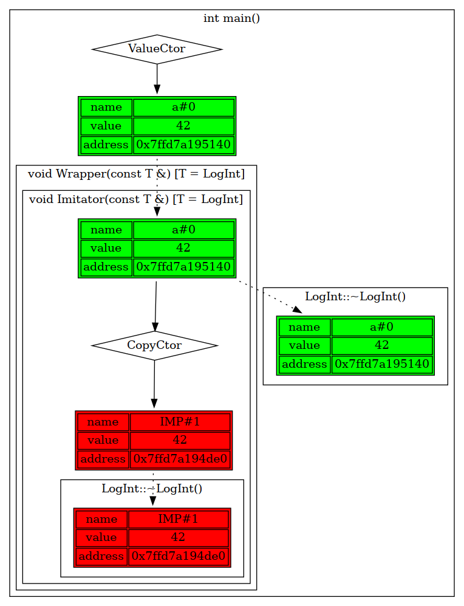
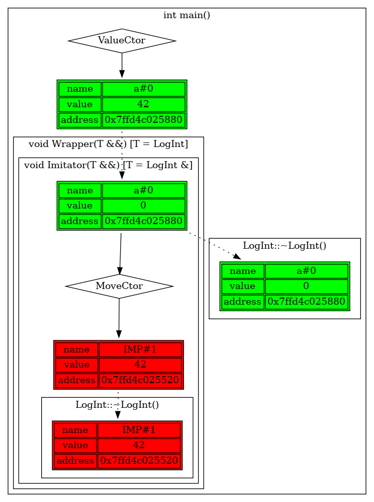

# std::move vs std::forward: differences and reasons for using both

## Introduction
Since C++11, we can use move semantics to avoid unnecessary copying. One of such cases is forwarding objects to containers. Somtimes copying an object on forwarding is too expensive. If our object is temporary or no longer required, we can pass it as `rvalue`. But what if we want to keep it and pass as `lvalue`?

## First problems
Let's write a wrapper function that forwards our objects to some container. At first, we can write something like that:

```
template<typename T>
void Imitator(const T& obj) {
  FUNC_LOG;
  volatile T copy = obj; // imitates of passing obj to some container
}

template<typename T>
void Wrapper(const T& obj) {
  FUNC_LOG;
  Imitator(obj);
}

int main() {
  LogIniter::GetInstance(LogType::GV);
  FUNC_LOG;

  LOG_INT_INIT_BY_VALUE(a, 42);
  Wrapper(my_move(a));

  return 0;
}
```
But here we use copy constructor of `T` in `Imitator` function. Let's use move semantics to avoid unnecessary copying:

```
template<typename T>
void Imitator(T&& obj) {
  FUNC_LOG;
  volatile typename my_remove_reference<T>::type copy = my_move(obj);
}

template<typename T>
void Wrapper(T&& obj) {
  FUNC_LOG;
  Imitator(obj);
}

int main() {
  LogIniter::GetInstance(LogType::GV);
  FUNC_LOG;

  LOG_INT_INIT_BY_VALUE(a, 42);
  Wrapper(my_move(a));

  return 0;
}
```
Compare results:
| copy | my_move |
|:-----------------------------------------------------------------:|:------------------------------------------------------------:|
|  |  |
| ***Picture 1***<br/>Temporary variable turns into lvalue          | ***Picture 2***<br/>The lvalue is forced to be rvalue        |

