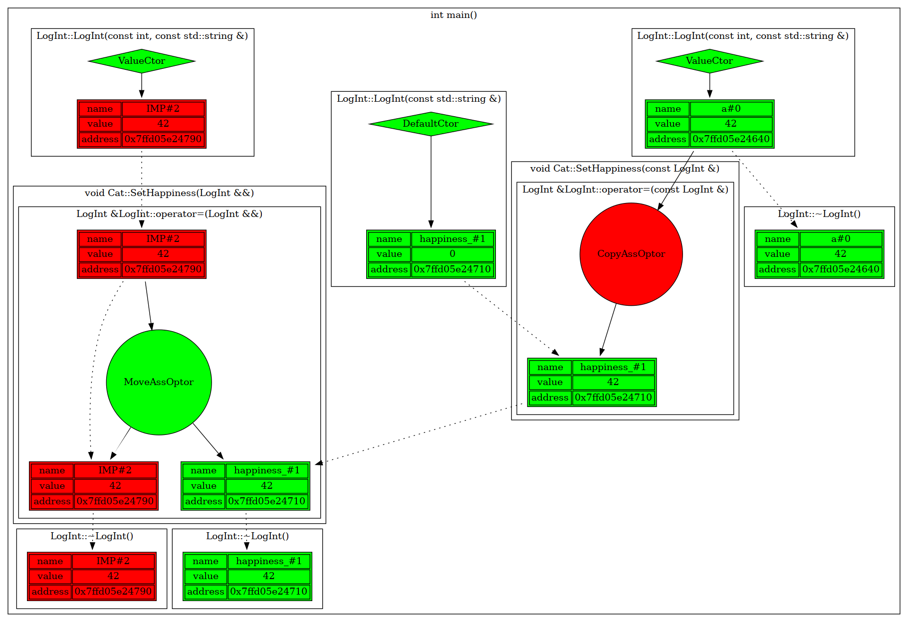
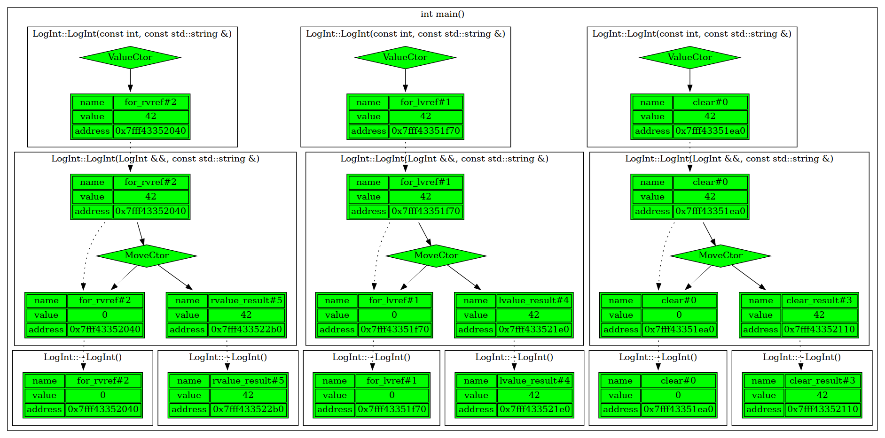
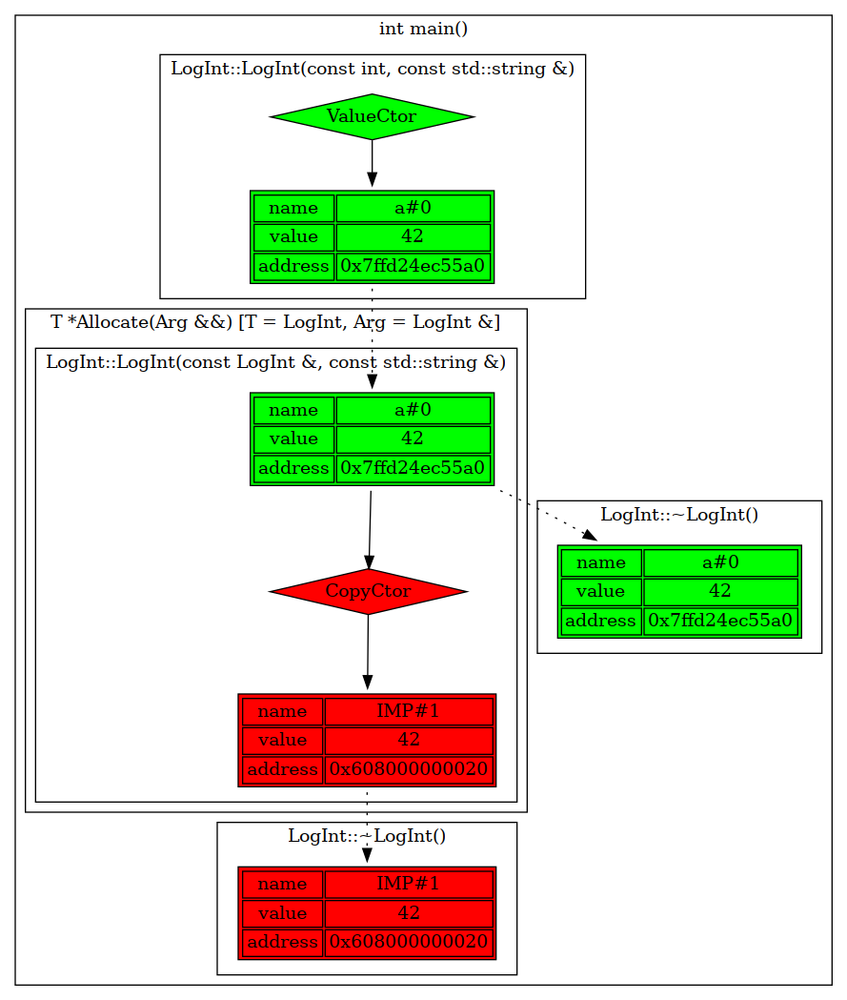
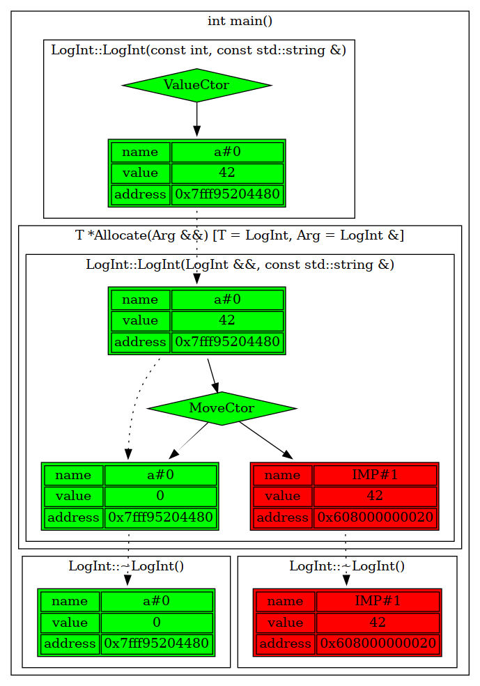
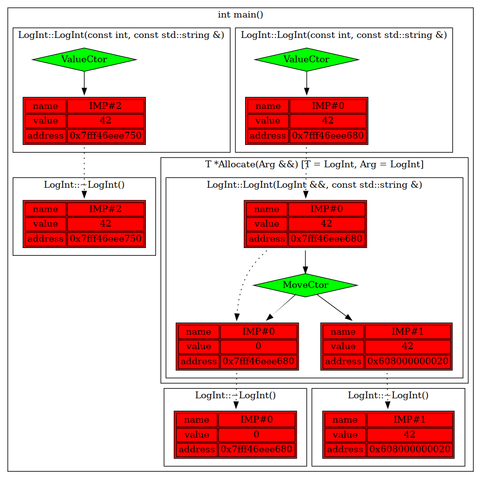

# std::move vs std::forward: differences and reasons for using both

## std::move
Let's write setter for some class.
```c++
 class Cat {
 public:
  void Meow() {
    // not implemented
    // depends on happiness
  }

  // calls when 'happiness' is lvalue
  void SetHappiness(const LogInt& happiness) {
    happiness_ = happiness; // copying assignment
  }

  // calls when 'happiness' is rvalue
  void SetHappiness(LogInt&& happiness) {
    happiness_ = static_cast<LogInt&&>(happiness); // moving assignment
  }

 private:
  LOG_INT_DECL(happiness_);

};

int main() {
  LogIniter::GetInstance(LogType::GV);
  FUNC_LOG;

  LOG_INT_INIT_BY_VALUE(a, 42);

  Cat cat;
  cat.SetHappiness(a);
  cat.SetHappiness(LogInt());

  return 0;
}
```
`static_cast<LogInt&&>` transforms local object `happiness` to `rvalue`.

`Cat::SetHappiness` is overloaded for two cases:
* `happiness` is `lvalue`. `Cat::SetHappiness(const LogInt&)` is called. Passed value **copied**.
* `happiness` is `rvalue`. `Cat::SetHappiness(LogInt&&)` is called. Passed value **moved**. `static_cast` is used because `happiness` is `lvalue` inside setter.

You can see results:
<pre>

</pre>

There's a way to avoid overloading. Let's forward `happiness` by value and move it to `Cat::happiness_`:
```c++
#include "log_initer.hpp"
#include "log_int.hpp"

class Cat {
 public:
  void Meow() {
    // not implemented
    // depends on happiness
  }

  void SetHappiness(LogInt happiness) {
    happiness_ = static_cast<LogInt&&>(happiness); // moving assignment
  }

 private:
  LOG_INT_DECL(happiness_);

};

int main() {
  LogIniter::GetInstance(LogType::GV);
  FUNC_LOG;

  LOG_INT_INIT_BY_VALUE(a, 42);

  Cat cat;
  cat.SetHappiness(a);
  cat.SetHappiness(LogInt());

  return 0;
}
```
There're two cases:
* We passed `lvalue` to `Cat::SetHappiness`. It copied to local variable `happiness`, then `happiness` moved to `Cat::happiness_`.
* We passed `rvalue` to `Cat::SetHappiness`. It moved to local variable `happiness`, then `happiness` moved to `Cat::happiness_`.

You can see results:
<pre>

</pre>
Here you can see our need to forcibly make `rvalue` object from `lvalue` in some cases. С++ standard library offers us `std::move` for it. It's convenient `static_cast` wrapper automatically deduce type and cast everything to `rvalue`. Let's see my own implementation of it:

```c++
template<typename T>
typename my_remove_reference<T>::type&& my_move(T&& obj) {
  return static_cast<typename my_remove_reference<T>::type&&>(obj);
}
```
There're two cases:
* `lvalue` were passed. `T` deduces to `ArgT&`.
* `rvalue` were passed. `T` deduces to `ArgT`.

It doesn't matter what we passed, because `typename my_remove_reference<T>::type&&` will have type `ArgT&&` in both cases, so we get `rvalue` at out everytime.

`my_remove_refference` is realised as template structure with no fields and partial template specialization:
```c++
template<typename T>
struct my_remove_reference {
  using type = T;
};

template<typename T>
struct my_remove_reference<T&> {
  using type = T;
};

template<typename T>
struct my_remove_reference<T&&> {
  using type = T;
};
```
Let's call `my_move` with `LogInt`, `LogInt&` and `LogInt&&` and check its work:
```c++
#include "move_semantics.hpp"
#include "log_initer.hpp"
#include "log_int.hpp"

int main() {
  LogIniter::GetInstance(LogType::GV);
  FUNC_LOG;

  LOG_INT_INIT_BY_VALUE(clear, 42);

  LOG_INT_INIT_BY_VALUE(for_lvref, 42);
  LogInt& lvalue_ref = for_lvref;

  LOG_INT_INIT_BY_VALUE(for_rvref, 42);
  LogInt&& rvalue_ref = static_cast<LogInt&&>(for_rvref);

  LOG_INT_INIT_BY_OTHER(clear_result, my_move(clear));
  LOG_INT_INIT_BY_OTHER(lvalue_result, my_move(lvalue_ref));
  LOG_INT_INIT_BY_OTHER(rvalue_result, my_move(rvalue_ref));

  return 0;
}
```
You can see that everything has moved:
<pre>

</pre>

It's time to rewrite our setter:
```c++
void SetHappiness(LogInt happiness) {
  happiness_ = my_move(happiness); // moving assignment
}
```
## std::forward
Sometimes we want to pass `lvalue` as `lvalue` and `rvalue` as `rvalue`.
```c++
// case 1
template<typename T, typename Arg>
T* Allocate(Arg&& arg) {
  FUNC_LOG;
  return new T(arg);
}

// case 2
template<typename T, typename Arg>
T* Allocate(Arg&& arg) {
  FUNC_LOG;
  return new T(my_move(arg));
}

// case 3
template<typename T, typename Arg>
T* Allocate(Arg&& arg) {
  FUNC_LOG;
  return new T(std::forward<Arg>(arg));
}

int main() {
  LogIniter::GetInstance(LogType::GV);
  FUNC_LOG;

  LOG_INT_INIT_BY_VALUE(a, 42);

  LogInt* p1 = Allocate<LogInt>(a);
  delete p1;

  return 0;
}
```
In case 1 argmunet always copies and sometimes it causes unnecessary copying. In case 2 argument always moves and it can be invalidated.

In case 3 we use `std::forward` to pass `lvalue` as `lvalue` and `rvalue` as `rvalue`:

|Value|Move|Forward|
|-------------------------------|-----------------------------|-----------------------------------|
||||

Implementation with `std::forward` copied object when we passed it as `lvalue`. Let's pass `rvalue`:
```c++
#include "forward/allocate_forward.hpp"
#include "log_initer.hpp"
#include "log_int.hpp"

int main() {
  LogIniter::GetInstance(LogType::GV);
  FUNC_LOG;

  LogInt* p1 = Allocate<LogInt>(LogInt(42));
  delete p1;

  return 0;
}
```
Let's see results:

|Passing rvalue using forward inside|
|-----------------------------------|
||

`std::forward` can be implemented like this:
```c++
// calls when we forward lvalue
template<typename T>
T&& my_forward(typename my_remove_reference<T>::type& obj) {
  return static_cast<T&&>(obj);
}

// calls when we forward rvalue
template<typename T>
T&& my_forward(typename my_remove_reference<T>::type&& obj) {
  return static_cast<T&&>(obj);
}
```

* If we forward `lvalue` to `Allocate`, universal link `ArgT&&` extracts as `ArgT&`, then first overload of `my_forward` is called and our argument passed as `lvalue` into constructor.
* If we forward `rvalue` to `Allocate`, universal link `ArgT&&` extracts as `ArgT&&`, then second overload of `my_forward` is called and our argmunent passed as `rvalue` into constructor.

## Conclusion
`std::move`:
1. Makes everything `rvalue`.
2. Uses when object is close to die. Helps to tell compiler to treat object as temporary to avoid unnecessary copying, e.g. in setters.

`std::forward`:
1. Saves the category of the expression.
2. Uses to forward objects through wrappers, e.g. `emplace_back`.

## Links
- [lvalues and rvalues](https://habr.com/ru/post/322132/)

- [perfect forwarding](https://habr.com/ru/post/242639/)

- [cppreference: remove_reference](https://en.cppreference.com/w/cpp/types/remove_reference)

- [cppreference: std::move](https://en.cppreference.com/w/cpp/utility/move)

- [cppreference: std::forward](https://en.cppreference.com/w/cpp/utility/forward)
